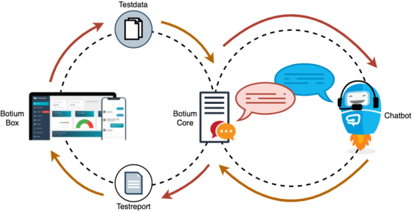

Introduction
************

What is Botium
==============

1. **Selenium** is the de-facto-standard for testing web applications.
2. **Appium** is the de-facto-standard for testing smartphone applications.
3. **Botium** is for testing conversational AI.

Just as Selenium and Appium, Botium is free and Open Source, and `available on Github <https://github.com/codeforequity-at/botium-core>`_.

What is Botium good for ?
=========================

`Botium <https://www.botium.ai/>`_ supports chatbot makers in `training and quality assurance <https://www.botium.ai/>`_:

* **Chatbot makers** define what the chatbot is supposed to do
* **Botium** ensures that the chatbot does what it is supposed to do

Here is the “Hello, World!” of Botium:::

  TC01_HELLO

  #me
  hello bot!

  #bot
  Hello, meat bag! How can I help you ?

The test case is named *TC01_HELLO*, and the chatbot is supposed to respond to a user greeting.

To name just a few features of Botium:

* Testing conversation flow of a chatbot

  * Capture and Replay
  * Integrated speech processing for testing voice apps

* Testing NLP model of a chatbot

  * Domain specific and generic datasets included
  * Paraphrasing to enhance test coverage

* E2E testing of a chatbot based on Selenium and Appium
* Non-functional testing of a chatbot

  * Load- and Stress testing
  * Security testing
  * GDPR testing

* CI/CD integration with all common products in that space (Jenkins, Bamboo, Azure DevOps Pipelines, IBM Toolchain, ...)
* and many more

Understanding the Botium Stack
==============================

When we talk about Botium, we usually mean the whole Botium Stack of components. It is built on several components:

* `Botium Core SDK <https://github.com/codeforequity-at/botium-core>`_ to automate conversations with a chatbot or virtual assistant
* `Botium CLI <https://github.com/codeforequity-at/botium-cli>`_, the swiss army knife to use all functionality of Botium Core in the command line
* `Botium Bindings <https://github.com/codeforequity-at/botium-bindings>`_, the glue to use Botium Core with test runners like Mocha, Jasmine or Jest
* `Botium Box <https://www.botium.ai>`_, the management and reporting platform for making chatbot test automation fast and easy - `Get your free instance here <https://www.botium.ai>`_
* `Botium Coach <https://www.botium.ai>`_ for continuous visualization of NLP performance metrics - `See Botium Coach Wiki <https://botium.atlassian.net/wiki/spaces/BOTIUMCOACH/pages/75235329/Botium+Coach+User+Manual>`_

Botium Core, the heart and brain of Botium
------------------------------------------

All of the components in the Botium Stack build on top of Botium Core (except Botium Core itself, naturally), the heart and brain of Botium. Just as the heart and brain in your body are vital parts with very low chances to ever see or touch them, you most likely won’t ever get in touch with Botium Core directly: it’s the fuel, the nuts and bolts, the core technology, the heart and brain of Botium.

Botium CLI, the swiss army knife of Botium
------------------------------------------

The Botium CLI is a command line tool to actually use everything Botium Core is capable to do. If Botium Core is the heart and brain of Botium, then the Botium CLI stands for the extremities, the hands and feets of Botium (this was the last anatomic analogy in this article). It is a command line tool, which means it doesn’t provide a graphical user interface with buttons, pictures and hyperlinks. While graphical user interfaces are nice for first time usage, they are a big impediment in process and test automation. That’s why we built the Botium CLI.

Botium Bindings, the glue to bind Botium to test runners
--------------------------------------------------------

A “test runner” is a piece of software which automatically runs thousands of test cases and outputs a nicely formatted summary about successful and failed test cases at the end. There are several test runners available you can choose from (Mocha, Jasmine, Jest, …) and Botium Bindings make them run the Botium test cases.

Botium Box, the management and reporting platform of Botium
-----------------------------------------------------------

Botium Box is the pretty face of Botium : A modern, responsive, easy-as-hell web-based graphical user interface to configure, control and monitor every aspect of Botium Core.

Botium Platform: Everything you need to run Botium in the Enterprise
--------------------------------------------------------------------

Botium Platform extends the open source Botium Stack libraries with enterprise features (relational database support, multiple deployment options, monitoring, build pipeline integration, load balancing and more) and includes enterprise-grade support.
While the Botium Stack libraries are open source and free (“free” as in “freedom” as well as in “free beer”), the Botium Platform is an SaaS offer.

Installation
============

You can find installation instructions in the Github repositories:

* `Botium CLI <https://github.com/codeforequity-at/botium-cli>`_ - available as Node.js module and Docker image
* `Botium Bindings <https://github.com/codeforequity-at/botium-bindings>`_ - available as Node.js module
* `Botium Box <https://www.botium.ai>`_ - available on-promise and as SaaS - `Get your free instance here <https://www.botium.ai>`_
