Testing Conversational AI
*************************

Parts of this guide have been published in the book `ACCELERATING SOFTWARE QUALITY - Machine Learning & Artificial Intelligence in the Age of DevOps <https://www.perfecto.io/resources/accelerating-devops-quality>`_ by `Eran Kinsbruner <https://www.linkedin.com/in/eran-kinsbruner-4b47a81/>`_.

.. _botium-basics:

Conversational Flow Testing
===========================

This section starts with some technical background on Botium and then
demonstrates a methodology to identify and formalize test cases for the
conversational flow of a chatbot. The conversational flow, often called
“user stories”, can be visualized in a flow chart.

|image5|

Hello, World! The Botium Basics
-------------------------------

The most basic test case in Botium consists of

-  submitting a phrase possibly entered by a real user to the chatbot

-  checking the response of the chatbot with the expected outcome

BotiumScript
~~~~~~~~~~~~

In Botium, the test cases are described by conversational flows the
chatbot is supposed to follow. For a sample “greeting” scenario, the
Botium test case looks like this — also known as “BotiumScript”::

   #me
   hello bot!

   #bot
   Hello, meat bag! How can I help you ?

You can write BotiumScript in several file formats

-  plain text file with Notepad or any other text editor

-  Excel file

-  CSV file (comma separated values)

-  JSON

-  YAML

Convos and Utterances
~~~~~~~~~~~~~~~~~~~~~

So, let’s elaborate the “Hello, World!”-example from above. While some
users will say “hello”, others maybe prefer “hi”::

   #me
   hi bot!

   #bot
   Hello, meat bag! How can I help you ?

Another user may enter the conversation with “hey dude!”::

   #me
   hey dude

   #bot
   Hello, meat bag! How can I help you ?

And there are plenty of other phrases we can think of. For this most
simple use case, there are now at least three or more BotiumScripts to
write. So let’s rewrite it. We name this file hello.convo.txt::

   TC01 - Greeting

   #me
   HELLO_UTT

   #bot
   Hello, meat bag! How can I help you ?

You may have noticed the additional lines at the beginning of the
BotiumScript. The first line contains a reference name for the test case
to make it easier for you to locate the failing conversation within your
test case library. And we add another file hello_utt.utterances.txt::

   HELLO_UTT
   hello bot!
   hi bot!
   hey dude
   good evening
   hey are you here
   anyone at home ?

-  The first BotiumScript is a **convo file** — it holds the structure of the conversation you expect the chatbot to follow.

-  The second BotiumScript is an **utterances file** — it holds several phrases for greeting someone, and you expect your chatbot to be able to recognize every single one of them as a nice greeting from the user.

Botium will take care that the convo and utterances files are combined
to verify every response of your chatbot to every greeting phrase. So
now let’s assume that your chatbot uses several phrases for greeting the
user back. In the morning it is::

   #me
   HELLO_UTT

   #bot
   Good morning, meat bag! How can I help you this early ?

And in the evening it is::

   #me
   HELLO_UTT

   #bot
   Good evening, meat bag! How can I help you at this late hour ?

Let’s extract the bot responses to another utterances file::

   BOT_GREETING_UTT
   Good evening
   Good morning
   Hello
   Hi

And now comes the magic, we change the convo file to::

   #me
   HELLO_UTT

   #bot
   BOT_GREETING_UTT

Utterances files can be used to verify chatbot responses as well. To
summarize:

-  An utterance referenced in a #me-section means: Botium, send every single phrase to the chatbot and check the response

-  An utterance referenced in a #bot-section means: Botium, my chatbot may use any of these answers, all of them are fine

Identification of Test Cases
----------------------------

If the flow chart is available, identification of the test cases is
actually straightforward: Each path through the flow chart from top to
bottom is a test case. Here is the path for the user story “User
composes customized bouquet”.

|image6|

And here is the path for “User selects anniversary bouquet”.

|image7|

Writing Test Cases for a conversational flow
--------------------------------------------

In BotiumScript, the conversational flow for user story “User composes
customized bouquet” can be expressed like this::

   #me
   I want to buy a bouquet

   #bot
   OK, do you want to compose a bouquet yourself ?

   #me
   Yes

   #bot
   OK, what kind of flowers would you like to add first ?

   #me
   Please add 5 red roses

   #bot
   Alright, I put 5 red roses in your lovely bouquet. Should I add anything else ?

   #me
   No, thanks.

   #bot
   Super!

As soon as a chatbot doesn’t respond as expected, the test case is
considered as failed and reported.

Writing Utterance Lists
-----------------------

What the flow charts don’t show are the endless possibilities for a user
to express an intent. For each node in the flow chart, there are various
input and output utterances to consider. The flow chart typically
pictures a “happy path” in the conversation, in a real-world scenario
the same conversation path and test case should be satisfied with most
usual utterances and utterance combinations.

|image8|

For the “I want to buy a bouquet”, there are plenty of other ways for a
user to express this intent:

-  “Give me some flowers”

-  “To the flower shop, please”

-  “purchase a bouquet”

-  …

All of these user examples are valid input for the same test case, and
in Botium these user examples are collected within an utterance list in
a text file::

   UTT_USER_ORDER_FLOWERS
   I want to buy a bouquet
   Give me some flowers
   To the flower shop, please purchase a bouquet

What the flow charts don’t show as well are the utterances used on the
other side, by the chatbot itself: a well-designed chatbot provides some
variance in conversation responses.

For example instead of “Okay! Would you like to compose a bouquet
yourself” the chatbot might as well respond with:

-  “Do you want me to suggest a composition?”

-  “Is it for a special occasion” ?

-  …

These utterances can be collected in another utterance list and used in
the test cases to allow the chatbot all responses matching one in this
list. The first part of the user story “User composes customized
bouquet” would then look like this::

   #me
   UTT_USER_ORDER_FLOWERS

   #bot
   UTT_BOT_COMPOSE_YN

The conversational flow remains the same, but there are many user
examples and chatbot responses allowed now.

Dealing with Uncertainty
------------------------

When using Botium, there are many options for asserting the chatbots
behaviour - the most simple one, assertion of the text response, is
shown above.

-  Asserting the presence of user interface elements, such as quick response buttons, media attachments, form input elements

-  Asserting with regular expressions and utterance lists

-  Asserting tone with a tone analyzer

   -  Validation that the chatbot tone matches the intended brand communication style

-  Asserting availability of hyperlinks presented to the user

-  Asserting custom message payload with JSONPath queries

-  Asserting business logic with API and data storage queries

Generating a Test Report
------------------------

There are several frontends available for generating a test report with
Botium.

Option 1: Botium CLI
~~~~~~~~~~~~~~~~~~~~

Run Botium CLI like this::

  botium-cli run

Botium CLI will build up a communication channel with your chatbot and
run all of your test cases. Status information and a summary are
displayed in the command line window.

Option 2: Botium Bindings
~~~~~~~~~~~~~~~~~~~~~~~~~

With Botium Bindings an established test runner like Mocha, Jest or
Jasmine can be used for running Botium test cases.::

  mocha ./spec

Option 3: Botium Box
~~~~~~~~~~~~~~~~~~~~

Use the Quickstart Wizard to connect your chatbot to your test sets and
run them.

|image9|

Utterance/Convo Expansion
=========================

The process of merging the utterance files with the convo files is called *Expansion*. See this convo file::

  #me
  HELLO_UTT

And this utterances file::

  HELLO_UTT
  hello
  hi
  what's up

* In case the convo expansion is disabled, the literal text HELLO_UTT is sent to the bot (which is most likely not what you want).
* In case the convo expansion is enabled, the user examples from the utterances file are sent to the bot (which is most likely what you want).

Enabling Convo Expansion
------------------------

* In **Botium CLI**, it is enabled by default
* In **Botium Bindings**, set the *expandConvos* option (see :ref:`Botium Bindings <botium-bindings>`)
* In **Botium Box**, use the *Scripting Settings* of the test set

Utterance Expansion
-------------------

There are cases when it makes sense to have utterance files only, without any convo files.

* Testing for incomprehension (chatbot does not understand)
* NLU/NLP Testing

Botium can then create convo test cases out of utterance files dynamically:

* For incomprehension testing, it is possible to define a special **INCOMPREHENSION** utterance file - see :ref:`SCRIPTING_UTTEXPANSION_INCOMPREHENSION <botium-caps-SCRIPTING_UTTEXPANSION_INCOMPREHENSION>`
* For NLU/NLP testing, Botium can check the returned NLU/NLP intent - see :ref:`SCRIPTING_UTTEXPANSION_USENAMEASINTENT <botium-caps-SCRIPTING_UTTEXPANSION_USENAMEASINTENT>`

Enabling Utterance Expansion:

* In **Botium CLI**, use the *--expandutterances yes* command line switch
* In **Botium Bindings**, set the *expandUtterancesToConvos* option (see :ref:`Botium Bindings <botium-bindings>`)
* In **Botium Box**, use the *Scripting Settings* of the test set

End-2-End Testing (Chatbot User Interfaces)
===========================================

Testing the user experience end-to-end has to be part of every test
strategy. Apart from the conversation flow, which is best tested on API
level, it has to be verified that a chatbot published on a company
website works on most used end user devices.

The special challenges when doing E2E tests for a chatbot are the high
amount of test data needed (> 100.000 utterances for a medium sizes
chatbot) and the slow execution time - in an E2E scenario tests are
running in real time. The good news are that for testing device
compatibility, a small subset of test cases is sufficient.

Safe Assumptions when testing a chatbot user interface
------------------------------------------------------

When testing a chatbot with Selenium, there are some safe assumptions
you can rely on to reduce effort when coding test cases:

1. The chatbot is accessible on a website and there maybe is some kind of click-through to actually open the chatbot window. The procedure to navigate and open the chatbot window is always the same for all test cases.

2. Somewhere in the chatbot window there is an input field for text messages. When hitting “Enter” or clicking on a button besides the input field the text will be sent to the chatbot.

3. Somewhere in the window the chatbot responds in some kind of list view. The text sent from the user is mirrored there as well.

4. The chatbot response contains text, pictures, hyperlinks and maybe quick response buttons to click

|image14|

Based on these assumptions an experienced Selenium developer will build
a page object model to reuse for all of the chatbot test cases.

Botium Webdriver Connector
--------------------------

If you ever worked with Selenium, you are aware that writing an
automation script usually is a time-consuming task. Botium helps you in
writing automation scripts for a chatbot widget embedded on a website
and speeds up the development process by providing a parameterizable,
default configuration for adapting it to your actual chatbot website
with Selenium selectors and pluggable code snippets:

-  Website address to launch for accessing the chatbot

-  Selenium selector for identification of the input text field

-  Selenium selector for identification of the "Send"-Button (if present, otherwise message to the chatbot is sent with "Enter" key)

-  Selenium selector for identification of the chatbot output elements

-  Selenium capabilities for device or browser selection or any other Selenium specific settings

*Note: Botium can work with any Selenium or Appium endpoint available -
either with a virtual browser like PhantomJS, an integrated standalone
Selenium service, your own custom Selenium grid, or with cloud providers
like Perfecto Labs.*

If there are additional steps (mouse clicks) to do on the website before
the chatbot is accessible, you will have to extend the pre-defined
Selenium scripts with custom behaviour as Javascript code.::

  module.exports = async (container, browser) => {
    const ccBtn = await browser.$('#onetrust-accept-btn-handler')
    await ccBtn.waitForClickable({ timeout: 20000 })
    await ccBtn.click()

    const startChat = await browser.$('#StartChat')
    await startChat.waitForClickable({ timeout: 20000 })
    await startChat.click()
  }

This code snippet does the following:

1. Waiting for a “Cookie Consent” button to appear on the website

2. Clicking this button to make the website usable

3. Waiting for a “Start Chat” button to appear and clicking it when available

4. Waiting until the basic chatbot interaction elements are visible

The full Botium configuration for this scenario looks like this::

  {
    "botium": {
      "Capabilities": {
        "PROJECTNAME": "WebdriverIO Plugin Sample",
        "CONTAINERMODE": "webdriverio",
        "WEBDRIVERIO_OPTIONS": {
          "capabilities": {
            "browserName": "chrome"
          }
        },
        "WEBDRIVERIO_URL": "https://www.my-company.com",
        "WEBDRIVERIO_OPENBOT": "./snippets/openbot",
        "WEBDRIVERIO_INPUT_ELEMENT": "//input[@id='textInput']",
        "WEBDRIVERIO_INPUT_ELEMENT_SENDBUTTON": "//button[contains(@class,'bot__send')]",
        "WEBDRIVERIO_OUTPUT_ELEMENT": "//div[contains(@class,'from-watson')]"
      }
    }
  }

With this configuration, all of your convo and utterances files can be
used to run test cases with Botium and Selenium.

Voice Testing (Voice-Enabled Chatbots)
======================================

When testing voice apps, all of the principles from the previous
sections apply as well. Some of the available voice-enabled chatbot
technologies natively support both text and voice input and output, such
as Google Dialogflow or Amazon Lex. Others are working exclusively with
voice input and output, such as Alexa Voice Service. And all the other
technologies can be extended with voice capabilities by inserting
speech-to-text and text-to-speech engines in the processing pipeline.

For doing serious tests at least the chatbot response has to be
available as text to use text assertions. Botium supports several
text-to-speech and speech-to-text engines for doing the translations.

*In addition to the well-known cloud services from Google and Amazon,
Botium also has its own free and open source speech service included -
Botium Speech Processing.*

There is one good reason for using voice instead of text as input to
your test cases, if there are historic recordings available when
transitioning from a legacy IVR system. Such libraries often are a
valuable resource for test data.

Continue to read about Voice App Testing in the `Botium Wiki <https://wiki.botiumbox.com/how-to-guides/voice-app-testing/>`_.

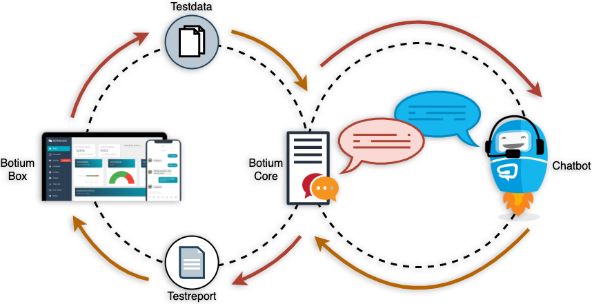
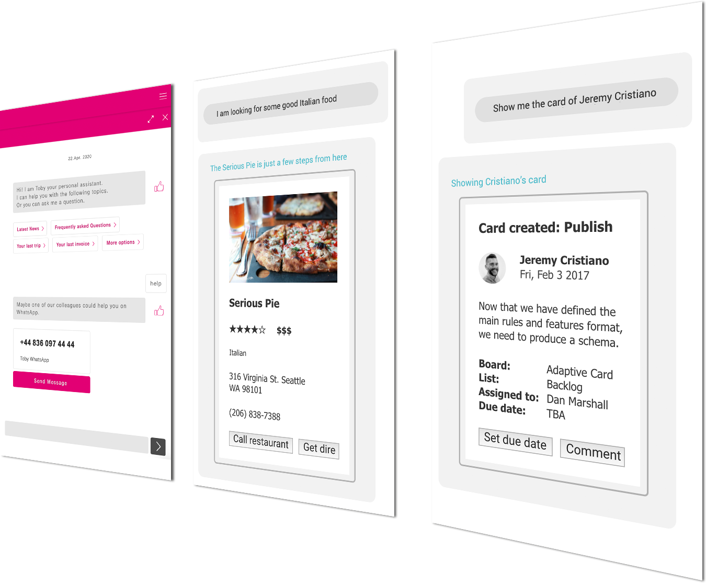
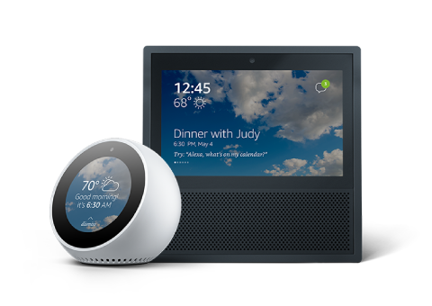
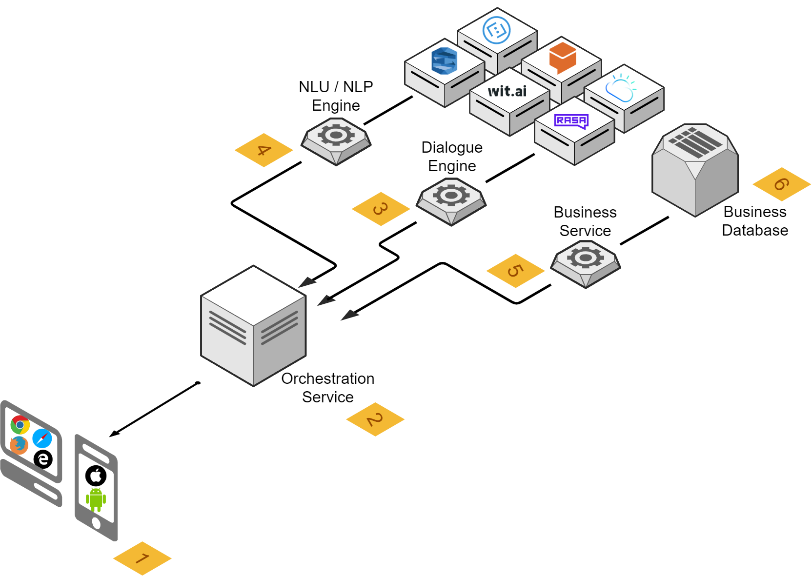
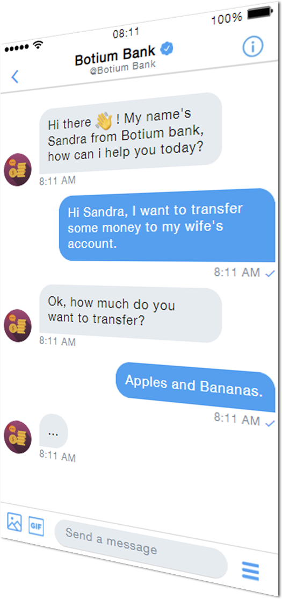
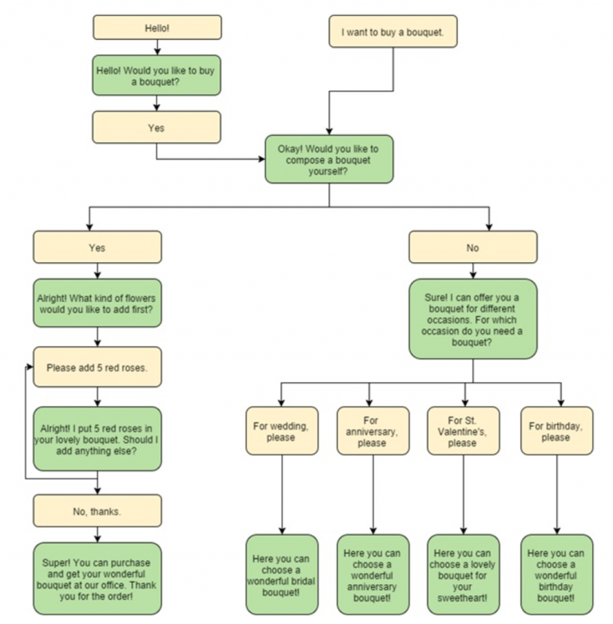
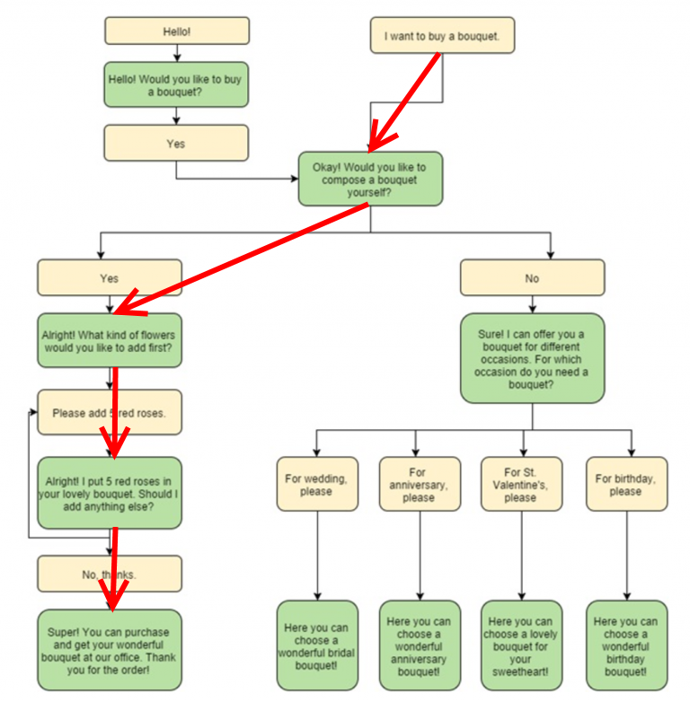
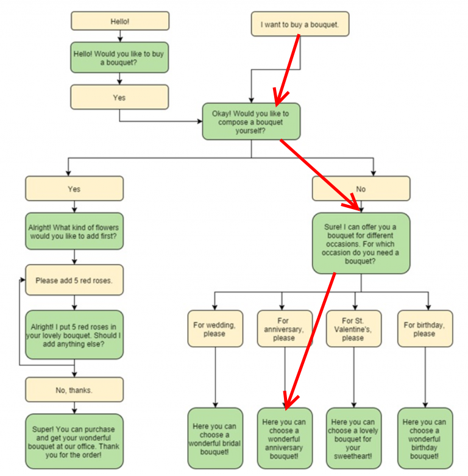
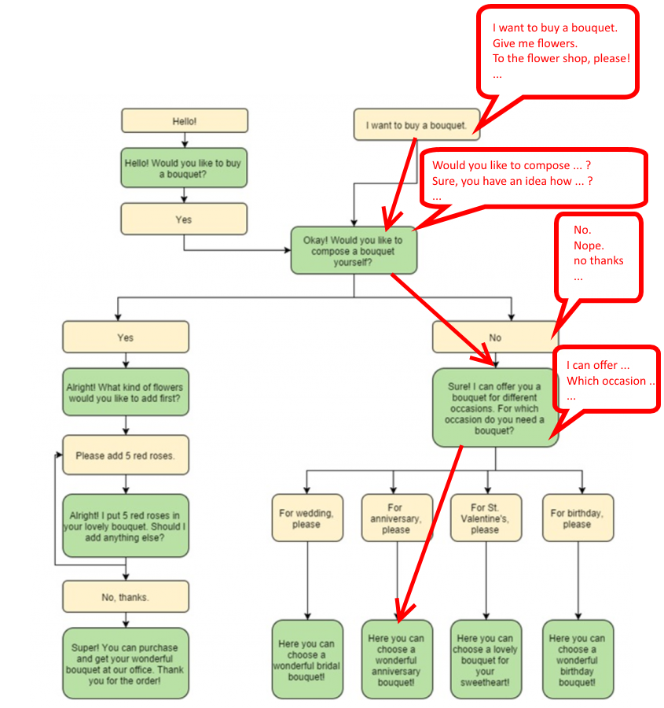
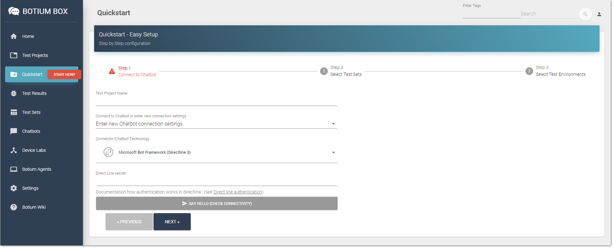
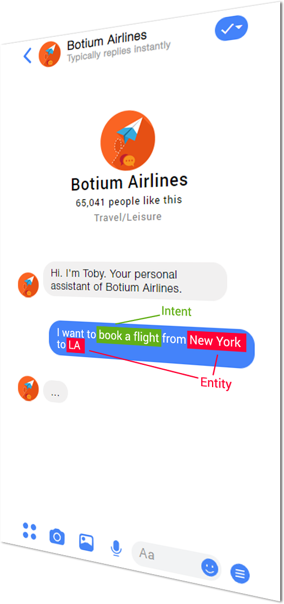
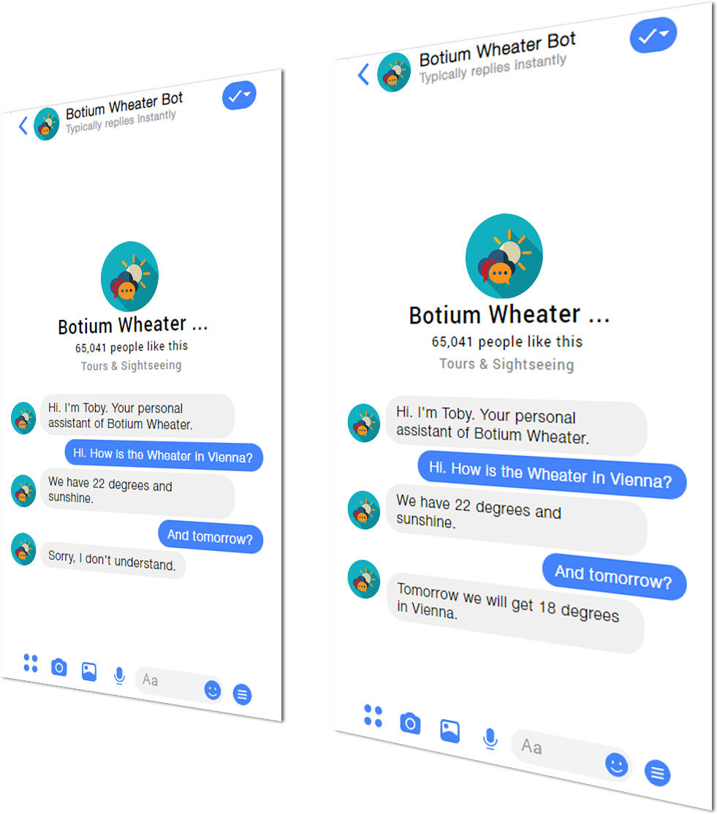
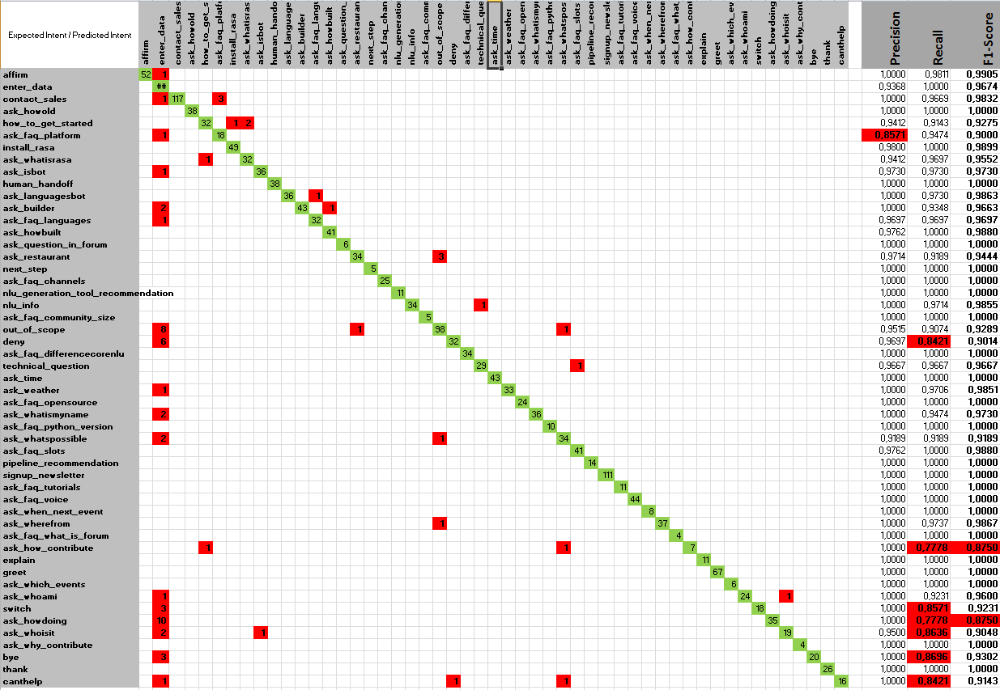
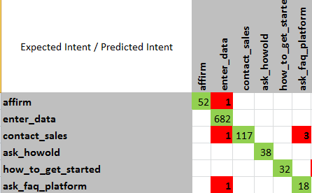
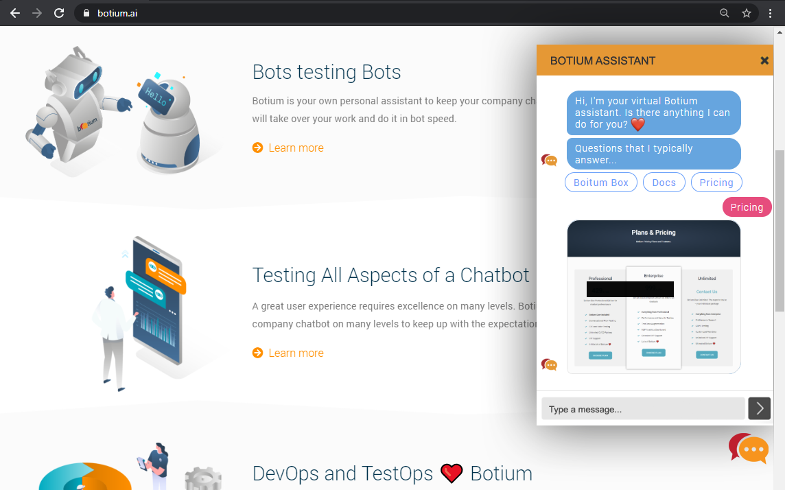
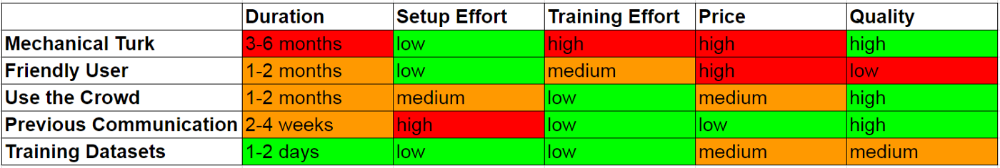
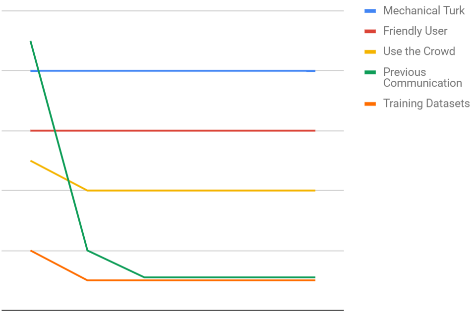
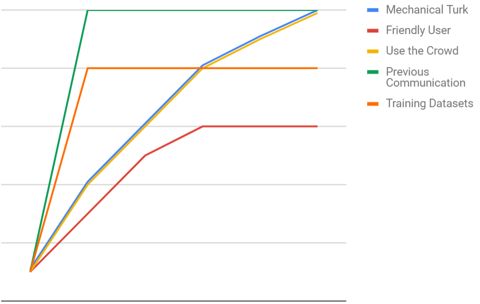
