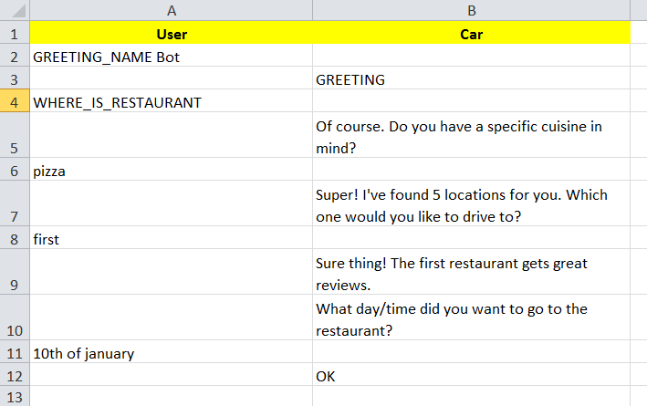

The Basics
==========

Botium supports running scripted, pre-defined or pre-recorded conversations written as **BotiumScript**. A conversation consists of a collection of

* User inputs which are sent to the chatbot
* Bot responses which are expected to be received from the chatbot
* Asserters and Logic Hooks to add advanced assertion or conversation flow logic
* Scripting Memory to set an get variables 

In case there are any differences in the bot responses from the pre-recorded scripts, the script returns a failure notification to the caller. (There are multiple checking methods. You can choose with :ref:`SCRIPTING_MATCHING_MODE capability <cap-scripting-matching-mode>`)

You can compose your scripted conversations using Text, Excel, CSV, YAML, JSON, Markdown files. You can even mix them in a single test. And with precompilers you can use your own custom JSON or Markdown format.

Convos
------

Convos are the skeleton of the Botium Scripting, they are describing the flow of a conversation.::

  #me
  hello

  #bot
  Hi!

  #me
  bye

  #bot
  Goodbye!

Utterances
----------

With Botium you can separate conversation structure from conversation content using Utterances. They can help you to create multilingual conversations, or alternative messages (like ‘bye’, and 'goodbye').

For the sample convo script above, the first text sent to the bot is hello - you surly want your chatbot to react on other greetings like hi, good afternoon, … write an additional utterances file::

  USER_HELLO_UTT
  hi
  hello
  nice day

To use this utterance named USER_HELLO::

  #me
  USER_HELLO_UTT

  #bot
  Hi!

  #me
  bye

  #bot
  Goodbye!

To make Botium use the utterances files in your convos:

* :ref:`When using Botium CLI <using-botium-cli>`, use the --expandutterances command line switch
* :ref:`When using Botium Bindings <using-botium-bindings>`, use the expandConvos flag in the package.json configuration

Scripting Memory
----------------

You can use Scripting Memory to make your test more dynamic. Within a single Botium conversation, it is possible to push variables to a memory and reuse it later. For example:

* an eCommerce chatbot tells some kind of "order number" ("Your order number is X-1235123")
* BotiumScript asks the bot later for the order status ("pls tell me the status for X-1235123")

You can use the predefined functions of Scripting Memory::

  #me
  My ID is $random10

And you can multiply your convo using Scripting Memory File. You can create two convos from your buy-beer convo to check that 2 beers costs 4$, and 3 beers costs 6$.

*The scripting memory is enabled by setting the :ref:`SCRIPTING_ENABLE_MEMORY capability <cap-scripting-enable-memory>`.*

Asserters and Logic Hooks
-------------------------

Asserters and Logic Hooks are used to inject advanced assertion or conversation logic into the conversation flow. They can be added at any position inside the convo file.::

  #me
  hello
  PAUSE 5000

*PAUSE* is one of the integrated logic hooks, which will just wait for a defined amount of time. The text following the asserter/logic hook reference name are the arguments, separated by a pipe sign ("|").

Some asserters and logic hooks are integrated into Botium, others are available as additional NPM packages (like Hyperlink Asserter), and you can develop them on your own using Sample Code.

Logic Hooks and User Input Methods always have to be placed below all text in the convo files, as they are always executed at the last possible point in the processing pipeline.

User Input Methods
------------------

Main communication channel between a user and chatbot is text. Some chatbots provide simple user interface elements such as buttons::

  #me
  show me some buttons

  #bot
  BUTTONS Button1|Button2|Button3

  #me
  BUTTON Button1

*BUTTON* will make Botium simulate a click on a button. The implementation depends on the connector in use - for example, the Webdriver connector will look for a HTML button and simulate a user click.

You can use Integrated User Inputs, or develop your own. 

Supported File Formats
======================

.. _botiumscript-text-files:

Composing in Text files
-----------------------

It should be so simple that everyone could compose the conversation files manually. Here is an example for a simple test conversation::

  Call Me Captain

  #me
  hello

  #bot
  Try: `what is my name` or `structured` or `call me captain`

  #me
  call me captain

  #bot
  Got it. I will call you captain from now on.

  #me
  who am i

  #bot
  Your name is captain

Conversation and Partial Conversation Syntax
~~~~~~~~~~~~~~~~~~~~~~~~~~~~~~~~~~~~~~~~~~~~

The rules are simple and concise:

* The first line is the name of the conversation or test case
* The second line up to the first line starting with # is an optional description text
* A line starting with #me will send the text following on the next line(s) to your chatbot

  * Anything following the #me in the same line will be the channel to send to - for example: #me #private will send the message to the private channel (Slack only)
  * In case there is a registered utterance detected with matching reference code (see below), the utterance samples are expanded (one conversation for each utterance) and sent to the chatbot
  * If the message to send is not specified, then an empty message will be sent to bot

* A line starting with #bot will expect your chatbot to answer accordingly

  * Anything following the #bot in the same line will be the channel to listen to - for example: #bot #general will wait for a message on the #general-channel (Slack only)
  * In case there is a registered utterance detected with mathing reference code (see below), your chatbot is expected to answer with one of the sample utterances
  * In case the utterance starts with a "!", the answer is checked to NOT match the text or one of the utterances samples. Except if it starts with at least two "!". In this case first "!" will be removed, and the remaining is checked normally (without negation).
  * If the message to receive is not specified, then the answer wont be checked.

* A line starting with #begin will be used on conversation begin only (mainly for asserters and logic hooks, see next section)
* A line starting with #end will be used on conversation end only (mainly for asserters and logic hooks, see next section)

That's it.

Utterances Syntax
~~~~~~~~~~~~~~~~~

* First line contains a "reference code" for the utterances
* Following lines contain sample utterances

*In order to have a clear distinction between literal text and reference code, the recommendation is to use a naming scheme with a special prefix, for example UTT_utterancename*

Example file::

  UTT_HELLO
  hi
  hello
  nice day

An example for a convo - saying "hello" to the bot should make the bot anwer "hi" or "hello" or any other of the above utterance samples.::

  Reply to hello

  #me
  Hello, Bot!

  #bot
  UTT_HELLO

printf
~~~~~~

It is possible to use a printf-like syntax with utterances - actually, the Node.js standard function util.format is used.::

  UTT_HELLO
  hi, %s
  hello, %s
  nice day

When using such utterance lists in convo files, you have to add a parameter::

  Reply to hello

  #me
  Hello, Bot!

  #bot
  UTT_HELLO user

So the texts matched are

* hi, user
* hello, user
* nice day

Scripting Memory Syntax
~~~~~~~~~~~~~~~~~~~~~~~

It’s a visual table format, columns are separated with the ||-character::

          |$productName    |$customer
  product1|Wiener Schnitzel|Joe
  product2|Frankfurter     |Joe

File naming convention
~~~~~~~~~~~~~~~~~~~~~~

* a file named "\*.convo.txt" will be considered as conversation file
* a file named "\*.pconvo.txt" will be considered as partial conversation file
* a file named "\*.utterances.txt" will be considered to contain utterances
* while a file named "\*.scriptingmemory.txt" will be considered to contain scripting memory data

.. _botiumscript-excel-files:

Composing in Excel files
------------------------

The structure is simple and visually appealing.

Conversation and Partial Conversation Syntax
~~~~~~~~~~~~~~~~~~~~~~~~~~~~~~~~~~~~~~~~~~~~

- First column holds the test case name (optional)
- Left column corresponds to the *#me* tag
- Right column corresponds to the *#bot* tag
- An empty row means the convo is over, and the next will start below

Download an example file :download:`with explicit test case names <media/excel/helloworld_namedconvos.xlsx>` and another one :download:`without explicit test case names <media/excel/helloworld.xlsx>`

If you put the #me and #bot message in the same row, then it is recognized as a simple one question one answer conversation. (You cannot mix this two mode on a single sheet) - download an example file :download:`here <media/excel/helloworldQestionAnswer.xlsx>`.

Test Case Naming
~~~~~~~~~~~~~~~~

* If the first column contains the test case name, it is used as-is
* Otherwise the test cases are named after the worksheet and the starting cell of the convo in the Excel file - in the above example, the test case is named *Dialogs-A2* (worksheet name + “-” + Excel cell reference)

Partial convos
~~~~~~~~~~~~~~

Partial convos are written same way as test case convos:

They are included by convo name with the *INCLUDE* statement:

Download an example file :download:`here <media/excel/partialconvo.xlsx>`

Utterances Syntax
~~~~~~~~~~~~~~~~~

-  Left column has the utterance name
-  Right column holds the list of utterance texts

Download an example file :download:`here <media/excel/utterances.xlsx>`

Scripting Memory Syntax
~~~~~~~~~~~~~~~~~~~~~~~

-  First column contains the test case name
-  Second column contains the variable name as header and the variable value

Download example files :download:`Products <media/excel/product.xlsx>` / :download:`Customers <media/excel/customer.xlsx>` / :download:`Convo <media/excel/buy.convo.txt>`

Specify Excel Worksheets and Regions
~~~~~~~~~~~~~~~~~~~~~~~~~~~~~~~~~~~~

You can tell Botium the sheets and the regions to look for convos and
utterances using additional capabilities - see below. By default, Botium
will identify the content areas in the worksheets automatically by
searching for the first filled cell (row by row).

When feeding Botium with **Excel files**, the worksheet names point to
either conversations, partial conversations utterances, or scripting
memory entries. By default, Botium assumes:

- that all Excel worksheets with name containing “convo” or “dialog” and not “partial” are for convos
- that all Excel worksheets with name containing “utter” are for utterances
- that all Excel worksheets with name containing “partial” are for partial convos
- that all Excel worksheets with name containing “scripting” or “memory” are for scripting memory

You can use these capabilities to tell Botium what worksheets to select
for convos, utterances, partial convos and scripting memory:

- SCRIPTING_XLSX_SHEETNAMES
- SCRIPTING_XLSX_SHEETNAMES_UTTERANCES
- SCRIPTING_XLSX_SHEETNAMES_PCONVOS
- SCRIPTING_XLSX_SHEETNAMES_SCRIPTING_MEMORY

Excel Parsing Capabilities
~~~~~~~~~~~~~~~~~~~~~~~~~~

**SCRIPTING_XLSX_MODE**

*Default: ROW_PER_MESSAGE*

Set it to QUESTION_ANSWER to force simple question-answer conversations. Botium makes a guess, so usually you dont have to use this cap.

**SCRIPTING_XLSX_HASHEADERS**

*Default: true*

When identifying content areas in the excel sheet, the first row usually
is a header row and skipped.

**SCRIPTING_XLSX_STARTROW**

Disable the automatic identification of content areas and use this
starting row in the excel sheets to look for convos and utterances.
Counting from 1.

**SCRIPTING_XLSX_STARTCOL**

Disable the automatic identification of content areas and use this
starting column in the excel sheets to look for convos and utterances.
Counting from 1. You can use column letters here as well ("A", "B",
...).

**SCRIPTING_XLSX_SHEETNAMES**

Comma separated list for sheetnames to look for convos. By default, all
sheets containing the name “convo” (and not “partial”) are used.

**SCRIPTING_XLSX_SHEETNAMES_UTTERANCES**

Comma separated list for sheetnames to look for utterances. By default,
all sheets containing the name “utter” are used.

**SCRIPTING_XLSX_SHEETNAMES_PCONVOS**

Comma separated list for sheetnames to look for partial convos. By
default, all sheets containing the name “partial” are used.

**SCRIPTING_XLSX_SHEETNAMES_SCRIPTING_MEMORY**

Comma separated list for sheetnames to look for scripting memory. By
default, all sheets containing the name “scripting” or “memory” are
used.

**SCRIPTING_XLSX_EOL_SPLIT**

*Default: \\r*

Line ending character in Excel. You shouldn't change this.

**SCRIPTING_XLSX_EOL_WRITE**

*Default: \\r\n*

Line ending character for Botium assertions. You shouldn't change this.

.. _botiumscript-csv-files:

Composing in CSV files
------------------------

You can read convos (*.convo.csv), partial convos (*.pconvo.csv) and utterances from CSV file.

CSV File Structure
~~~~~~~~~~~~~~~~~~

There are several structures possible. The suggestion is to stick with the default structures, but you can tune them with capabilities, see below.

* First row is the header row (will be skipped)
* Column delimiter is auto-dected (comma, tab, …) (can be fixed)
* structure is recognized by number of columns

3 Columns: Multi-Turn Conversations
~~~~~~~~~~~~~~~~~~~~~~~~~~~~~~~~~~~

For multi-turn conversations, there are 3 columns required:

* the “conversationId”-column for grouping conversations together (something unique, no restrictions on format - can be something like the test case name)
* The “sender”-column for Botium to know if to send to the bot or listen for bot responses (“me” or “bot”)
* The “text” column for Botium to send to the bot or listen as response

A simple conversation looks like this::

  conversationId,sender,text
  first,me,hello
  first,bot,Hi!

2 Columns: 1-Turn Conversations (Question/Answer)
~~~~~~~~~~~~~~~~~~~~~~~~~~~~~~~~~~~~~~~~~~~~~~~~~

There are 2 columns required for question/answer:

* first column contains the question (“#me”)
* second column contains the expected answer (“#bot”)

A simple conversation looks like this::

  question,answer
  hello,Hi!

1 Column: Utterances list
~~~~~~~~~~~~~~~~~~~~~~~~~

Same format as text utterances file

* first line (header) is the utterance name (header won’t be skipped here)
* other lines are the user examples

::

  UTT_NAME
  hello
  Hi!

CSV Parsing Capabilities
~~~~~~~~~~~~~~~~~~~~~~~~

**SCRIPTING_CSV_DELIMITER**

*Default: auto-detected*

Column separator used for CSV format

**SCRIPTING_CSV_QUOTE**

*Default: “*

**SCRIPTING_CSV_ESCAPE**

*Default: “*

**SCRIPTING_CSV_SKIP_HEADER**

By default, a header line is expected. 

**Column Selectors**

By default, the column order is according to the structure (see above). If you have a different column order, you can select other columns by specifying the header name (if present), or the column index (starting with 0):

* SCRIPTING_CSV_MULTIROW_COLUMN_CONVERSATION_ID
* SCRIPTING_CSV_MULTIROW_COLUMN_SENDER
* SCRIPTING_CSV_MULTIROW_COLUMN_TEXT
* SCRIPTING_CSV_QA_COLUMN_QUESTION
* SCRIPTING_CSV_QA_COLUMN_ANSWER

.. _botiumscript-yaml-files:

Composing in YAML files
-----------------------

::

  convos:
    - name: goodbye
      description: desc of convo goodbye
      steps:
        - begin:
            - PAUSE 500
        - me:
            - bye
        - bot:
            - goodbye!
    - name: convo 1 name
      description: desc of convo
      steps:
        - me:
            - GEETING
            - PAUSE:
              - 500
        - bot:
            - NOT_TEXT:
              - hello
            - INTENT:
              - intent_greeting
        - bot:
            - what can i do for you?
        - me:
            - nothing
        - bot:
            - thanks
  utterances:
    GREETING:
      - hi
      - hello!

Starting ! is used to denote the YAML, so quote can help to negate assertions (if using flat strings for assertions).::

  convos:
    - name: quote
      steps:
        - me:
            - Hello!
        - bot:
            - "!TEXT_CONTAINS_ANY goodbye, bye"

When using nested YAML objects for assertions (see example above), prefix the asserter name with NOT\_ (! is not allowed to be used as tag names in YAML).

.. _botiumscript-json-files:

Composing in JSON files
-----------------------

::

  {
    "convos": [
      {
        "name": "goodbye",
        "description": "desc of convo goodbye",
        "steps": [
          {
            "begin": [
              { "logichook": "PAUSE", "args": "500" }
            ]
          },
          {
            "me": [
              "bye"
            ]
          },
          {
            "bot": [
              "goodbye!"
            ]
          }
        ]
      },
      {
        "name": "convo 1 name",
        "description": "desc of convo",
        "steps": [
          {
            "me": [
              "hi",
              "PAUSE 500"
            ]
          },
          {
            "bot": [
              { "asserter": "TEXT", "args": "hello", "not": true },
              { "asserter": "INTENT", "args": "intent_greeting" }
            ]
          },
          {
            "bot": [
              "what can i do for you?"
            ]
          },
          {
            "me": [
              "nothing"
            ]
          },
          {
            "bot": [
              "thanks"
            ]
          }
        ]
      }
    ],
    "utterances": {
      "GREETING": [
        "hi",
        "hello!"
      ]
    }
  }

.. _botiumscript-markdown-files:

Composing in Markdown files
---------------------------

::

  # Convos
  ## Test Case 1
  - me
    - hello bot
  - bot
    - hello meat bag
    - BUTTONS checkbutton|checkbutton2
  ## Test Case 2
  - me
    - hello bot
  - bot
    - TEXT
      - hello meat bag
    - BUTTONS
      - checkbutton
      - checkbutton2
  ## Test Case with utterances
  - me
    - UTT_HELLO
  # Utterances
  ## UTT_HELLO
  - hi
  - hello
  - greeting